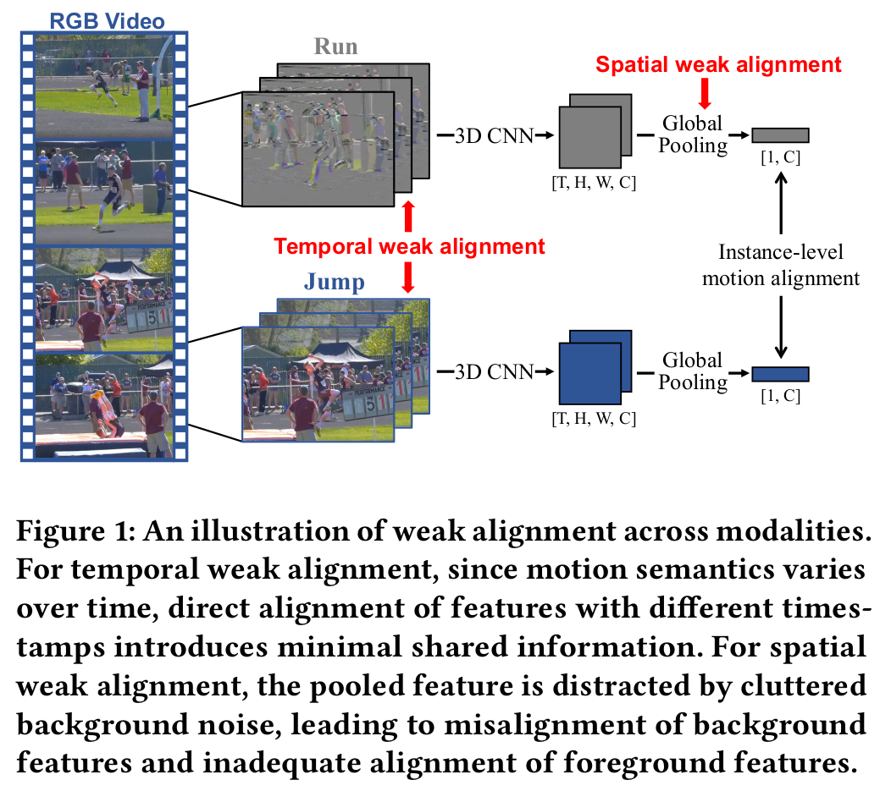
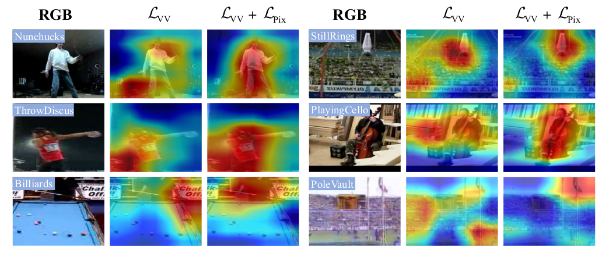

# [MM' 2023] Fine-Grained Spatiotemporal Motion Alignment for Contrastive Video Representation Learning
## Overview

Motion information is critical to a robust and generalized video representation. However, the representations learned by the vanilla instance-level contrastive loss are easily overwhelmed by static background cues and lack the ability to capture dynamic motion information. Recent works have adopted frame difference as the source of motion information and align the global pooled motion features at the instance level, which suffers from spatial and temporal weak alignment between the RGB and frame difference modalities. We present a Fine-grained Motion Alignment (FIMA) framework, capable of introducing well-aligned motion information from the noisy frame difference. By introducing fine-grained motion information, the representations learned by FIMA have strong generalization and transferability on various downstream tasks.



## :hammer: Requirements

- pytorch >=1.10.1
- cv2
- kornia
- av
- tensorboard

## :link: Dataset preparation

- Download the UCF101 dataset from the [official website](https://www.crcv.ucf.edu/data/UCF101.php).
- Download the Kinetics400 dataset from the [official website](https://deepmind.com/research/open-source/kinetics). 
- We rescale all videos to height=256 pixels, it is not necessary, but it will save a lot of memory storage space and fast IO speed.

## Pretrain

In default, we pretrain networks on K400 for 100 epochs. 

```python
python3 train.py \
  --log_dir $PATH_TO_LOG_DIR \
  --ckp_dir $PATH_TO_CKP_DIR \
  -a I3D \
  --dataset ucf101 \
  --lr 0.01  \
  -fpc 16 \
  -cs 224 \
  -b 64 \
  -j 16 \
  --cos \
  --epochs 100 \
  --pos_ratio 0.7 \
  --dist_url 'tcp://localhost:10001' --multiprocessing_distributed --world_size 1 --rank 0 \
  $PATH_TO_K400
```

## Evaluation

In default, we fine-tune pre-trained model on UCF101 for 150 epochs

```python
python3 eval.py \
  --log_dir $PATH_TO_LOG \
  --pretrained $PATH_TO_PRITRAINED_MODEL \
  -a I3D \
  --seed 42 \
  --num_class 101 \
  --lr 0.01 \
  --weight_decay 0.0001 \
  --lr_decay 0.1 \
  -fpc 16 \
  -b 16 \
  -j 16 \
  -cs 224 \
  --finetune \
  --epochs 150 \
  --schedule 60 120 \
  --dist_url 'tcp://localhost:10001' --multiprocessing_distributed --world_size 1 --rank 0 \
  $PATH_TO_UCF101
```

## Pre-trained Model

R(2+1)D K400 pre-trained model

| Network |              Dataset               | URL  |
| :-----: | :--------------------------------: | :--: |
| R(2+1)D |          K400 Pre-trained          |      |
| R(2+1)D | K400 Pre-trained UCF101 Fine-tuned |      |

## Results

#### Action Recognition:

#### UCF101 Pretrained (I3D, Fine-tune)

|    Method     | UCF101 | HMDB51 |
| :-----------: | :----: | :----: |
| MoCo baseline |  76.7  |  48.8  |
|     FIMA      |  84.2  |  57.8  |

#### UCF101 Pretrained (I3D, Linear-probing)

|    Method     | UCF101 | HMDB51 |
| :-----------: | :----: | :----: |
| MoCo baseline |  58.1  |  26.7  |
|     FIMA      |  75.3  |  42.8  |

## :bulb: Visualization

We visualize the model attention by applying the class-agnostic activation map. FIMA is effective for alleviating the background bias.



## :memo: Acknowledgement

Our code builds on [MoCo](https://github.com/facebookresearch/moco) and [FAME](https://github.com/Mark12Ding/FAME). Thank them for their excellent work and please keep an eye out for these works!

## :pushpin: BibTeX & Citation

 If our work is useful to you, please consider citing our paper using the following BibTeX entry.

```bibtex

```

